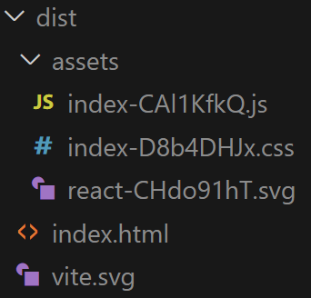

# React + TypeScript + Vite + BC AL

This template provides a minimal setup to get React working in Business Central.

## Steps to run the react app locally

- Clone the repo.
- Run `npm install`.
- Execute `npm run dev`.

## Build and Bundle Your React App
Use Vite or Webpack to bundle your React app into a single `.js` file

- Execute `npm run build`.
- dist folder is created automatically with some files and it should look like

- In order to test and run the app from the dist folder, run `powershell -ExecutionPolicy Bypass -File ./serve-dist.ps1` on Windows. Your dist folder is now being served locally.
- Open your broswer and go to `http://localhost:<port_number>`. You get the port number in the terminal after you extecuted the above powershell command.
